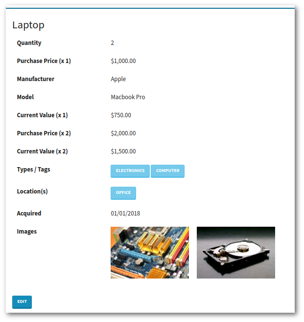
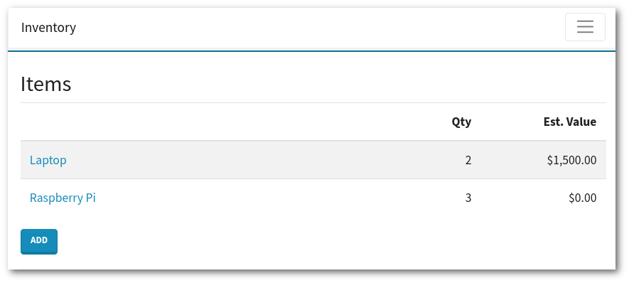
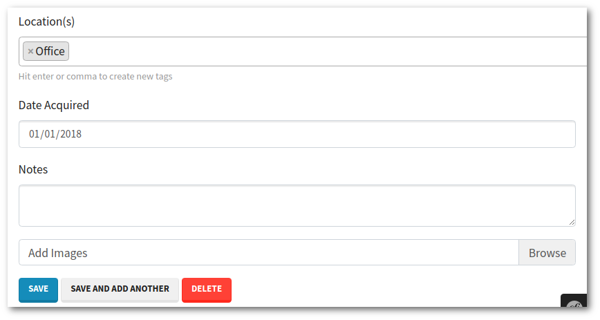

Personal Inventory Web Application
==================================

This is a web application for managing a personal inventory or collection. It's meant to be run on your computer or home network.  It's great for

- Maintaining a home inventory for insurance purposes
- Keeping track of home electronics
- Organizing a coin, stamp, or other collection

Advantages to using this system over a simple spreadsheet:

- Quickly browse by type or location
- Incorporate photos and images
- Comfortabe browsing and editing on a mobile device

Screenshots
-----------

Photos
------

To take a photo of an item, simply browse to the site on your mobile device.  When editing an item the "upload photo" button will trigger your device to ask if you'd like to use your camera or pick a photo from your camera roll.

Running the Application
-----------------------

### With Docker

We include a docker configuration to get up and running quickly and easily.  The only requirement is docker and docker-compose.  To run the personal inventory manager on a single desktop computer:

1. Run `./bin/setup.sh`. This only needs to be run once or after downloading updates.
1. Run `docker-compose up`.  Add `-d` to run it in the background.
1. Open http://localhost in your favorite browser.

For any other type of setup, such as on a home network server, edit or override the settings in `docker-compose.yaml` and `docker/web/Dockerfile`.  To point to a MongoDB server other than the one included, edit the `.env` file.  For development it's handy to set `APP_ENV=dev` in `.env` to get access to the Symfony framework's profiler and extra debugging info.

### Without Docker

This personal inventory manager is a standard PHP web application.  Requirements:

- A web server running PHP 7.2
- PHP extensions: bcmath, exif, gd, mongodb
- PHP's composer package manager
- MongoDB 4

Setup:

- Copy `.env.dist` to `.env` and set `DATABASE_URL` to point to your running MongoDB server.
- Set the `data/images` directory to be writable by the web server.
- Set the web server's document root to be the `public` directory with all requests going to `index.php`.
- Run `composer install`. 

Data Storage
------------

By default data is written to the project's `/data` directory.  This can be changed by editing or overriding the `docker-compose.yaml` file.

Images are stored in the `/data/images` directory.  When running with the default docker setup, application data is stored using MongoDB in the `/data/db` directory.

Security
--------

There is no included user authentication, data encryption, or other security.  This isn't intended to be run as-is on the open internet. If you'd like to secure the application and its data we suggest editing your web server configuration to include at least HTTP Basic Authentication and HTTPS.  Also block remote connections to MongoDB.  *Caveat emptor*.

TODO
----

In the future we plan on including 

- PDF export useful for insurance purposes
- Links to various online stores to make it easy to order more of an item.  
- Configurable depreciation schedule to estimate current values
